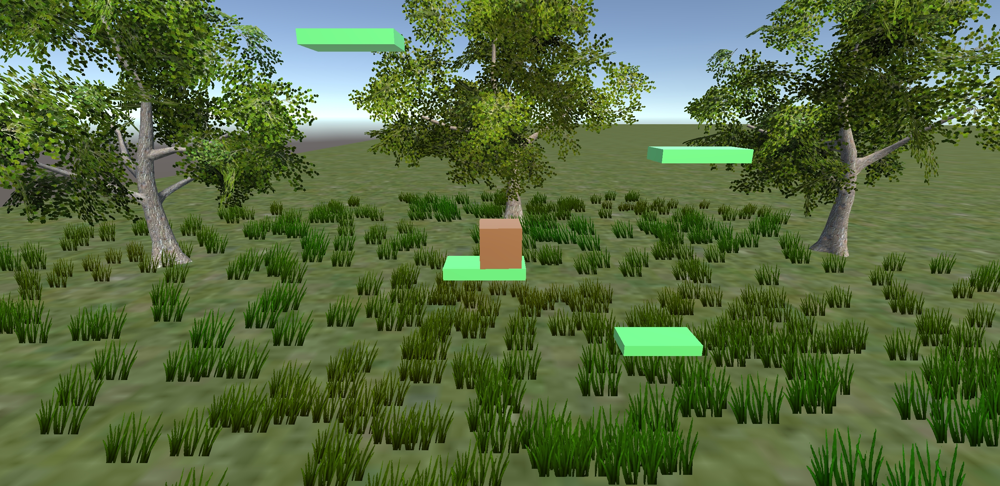

# JumpingBox
Android 3D platform game. 
Game where the idea is to jump from platform to platform to get higher. 
As of now there is a fixed height you can jump to, but my plan is to make the platforms spawn randomly.
You controll the box by tilting the phone, and jumping by pressing any place on the screen. 
It's possible to dubble jump as well, so that the gaps can be longer. 

